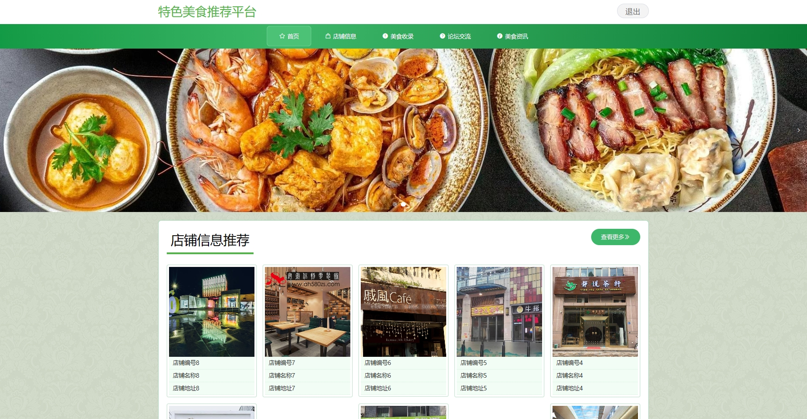

# 1.项目介绍
- 系统角色：管理员、普通用户
- 功能模块：管理员（用户管理、店铺管理、美食类型、美食收录管理、论坛交流管理等）、普通用户（登录注册、论坛交流、信息查看、美食收藏、美食资讯等）
- 技术栈：SSM、vue等
- 测试环境：idea2024、navicat、MySQL5.7、Maven3、tomcat8
# 2.项目部署
- 通过Navicat创建数据库，导入sql
- 根据本地数据库环境，修改src/main/resources/config.properties  3-5行（这步很关键）
- 配置tomcat，并启动
- 管理web：http://localhost:8080/ssm4z7il/admin/dist/index.html（注意这个ssm4z7il，是我在tomcat配置里设置的，你可以自己修改），账号密码：admin/admin
- 门户web：http://localhost:8080/ssm4z7il/front/index.html  账号密码自行查询数据库
# 3.项目部分截图

# 4.获取方式
[戳我查看](https://gitee.com/aven999/mall)